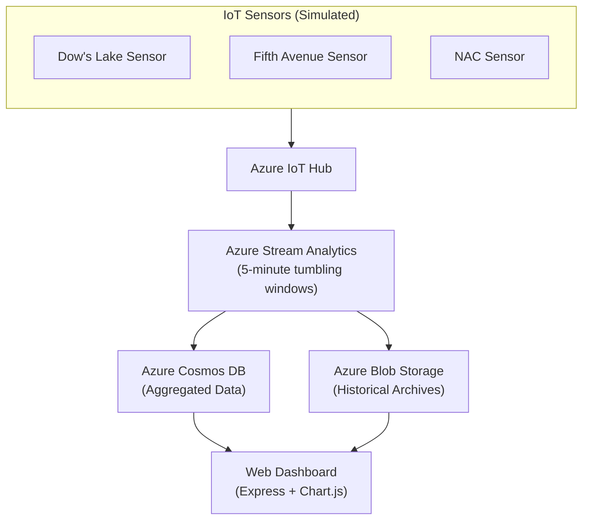
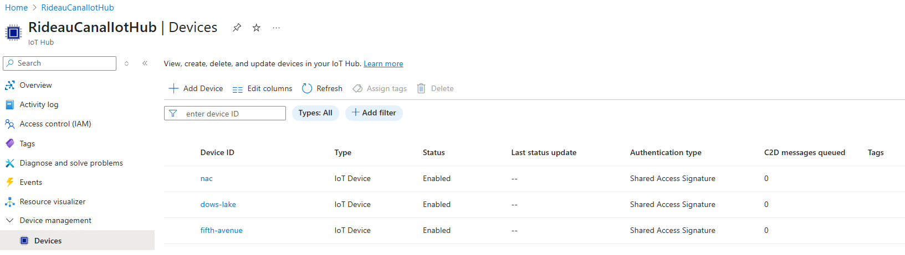
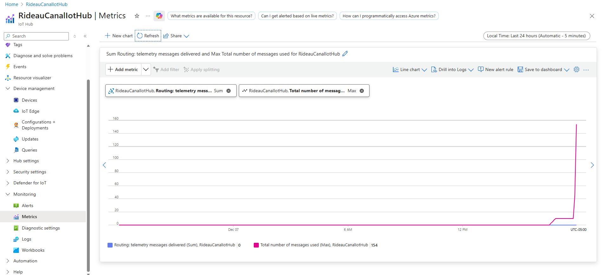
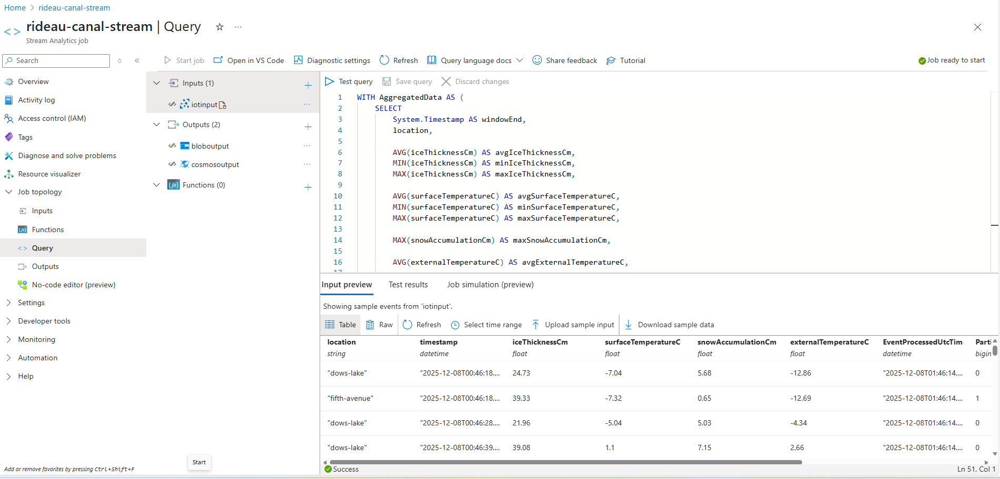
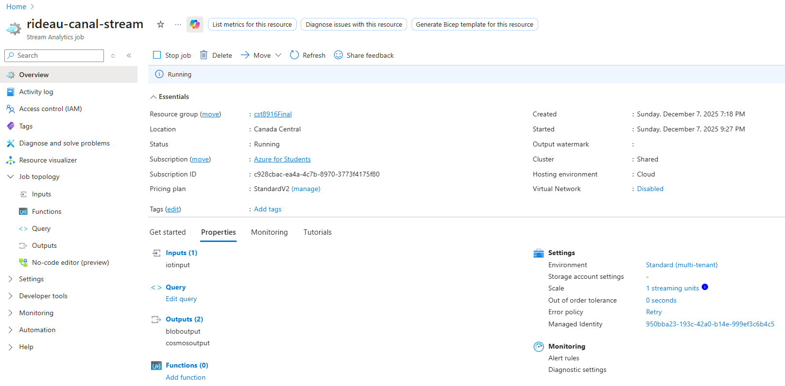
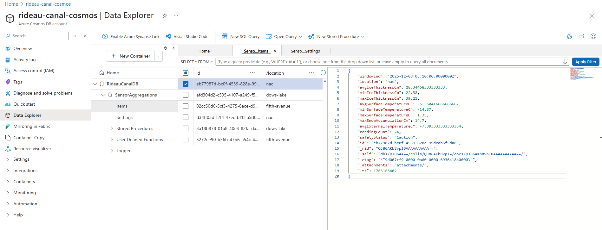
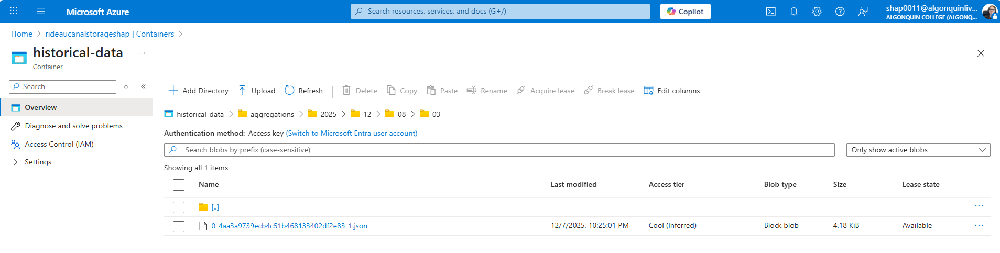
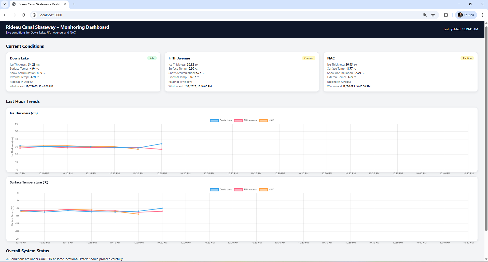
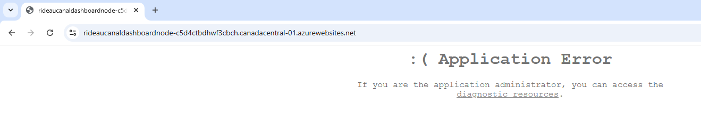
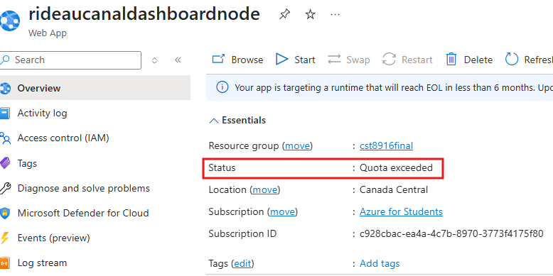

# Rideau Canal Real-time Monitoring System

## CST8916 – Remote Data & Real-Time Applications (Final Project)

[📘 Main Documentation](https://github.com/shap0011/rideau-canal-monitoring)
•
[📡 Sensor Simulation](https://github.com/shap0011/rideau-canal-sensor-simulation)
•
[📊 Web Dashboard](https://github.com/shap0011/25F_CST8916_Final_Project_Web-Dashboard)
•
[🎥 Video](https://youtu.be/tET3iHNK-CU)

---

## Technologies

### At a Glance

- **3 simulated IoT sensors** (Dow's Lake, Fifth Avenue, NAC)
- **Telemetry every 10 seconds**
- **Azure Stream Analytics** with **5-minute tumbling windows**
- **Cosmos DB** stores aggregated results
- **Blob Storage** archives JSON history
- **Web dashboard** shows:
  - Latest values
  - Safety status
  - Trend charts (Chart.js)

---

## 1. Project Title and Description

A real-time monitoring system for the **Rideau Canal Skateway** that simulates IoT sensors, processes their data in Azure, and displays results in a web dashboard.

---

## 2. Student Information

- **Name:** Olga Durham
- **Student ID:** 040687883
- **Course:** 25F CST8916 Remote Data and RT Applications

---

## 3. Scenario Overview

### Problem Statement

The Rideau Canal’s ice conditions change throughout the day and require constant monitoring to ensure public safety.

### System Objectives

- Simulate IoT sensors at three key locations.
- Stream telemetry to Azure IoT Hub.
- Aggregate real-time data in Azure Stream Analytics (5-minute windows).
- Store processed data in Cosmos DB and archive historical windows to Blob Storage.
- Display live conditions, safety statuses, and historical trends on a dashboard.

---

## 4. System Architecture

### 4.1 Architecture Diagram

### 4.2 Azure Services Used

- Azure IoT Hub – sensor data ingestion
- Azure Stream Analytics – real-time processing
- Azure Cosmos DB – fast read access for dashboard
- Azure Blob Storage – long-term historical archive
- Azure App Service – attempted deployment of dashboard

### 4.3 Data Flow

**1. Sensor Simulation:** Python script generates telemetry (ice thickness, surface temp, snow accumulation, external temperature) every **10 seconds** for:

- Dow's Lake
- Fifth Avenue
- NAC

**2. Azure IoT Hub:** Ingests telemetry from the three simulated devices.

**3. Azure Stream Analytics:**

- Reads telemetry from IoT Hub
- Performs **5-minute tumbling window** aggregations
- Computes min/max/averages
- Applies the safety rules:

  - **Safe:** Ice ≥ 30 cm AND Surface Temp ≤ –2°C
  - **Caution:** Ice ≥ 25 cm AND Surface Temp ≤ 0°C
  - **Unsafe:** otherwise

- Outputs results to:
  - **Cosmos DB** (live dashboard queries)
  - **Blob Storage** (historical archive)

**4. Web Dashboard (Node.js + Express):**

- Queries Cosmos DB for live + recent historical data
- Displays:
  - Live values per location
  - Safety badges
  - Trend charts using Chart.js
  - Auto-refresh (optional)

---

## 5. Implementation Overview

**IoT Sensor Simulation**

- Repository: [rideau-canal-sensor-simulation](https://github.com/shap0011/rideau-canal-sensor-simulation)
- Python script simulating three IoT devices
- Sends JSON telemetry every 10 seconds to IoT Hub

**Azure IoT Hub**

The IoT Hub ingests telemetry from the three simulated devices representing:

- Dow's Lake
- Fifth Avenue
- NAC

The devices were created in the Azure IoT Hub under:

- Resource group: `cst8916Final`
- Region: `Canada Central`
- Devices: `dows-lake`, `fifth-avenue`, `nac`

**IoT Hub – Registered Devices**

**IoT Hub – Telemetry Metrics**

**Azure Stream Analytics Job**

- Input: IoT Hub
- Outputs: Cosmos DB + Blob Storage
- Window: 5-minute tumbling
- Query: see _[stream-analytics/query.sql](./stream-analytics/query.sql)_

**Stream Analytics Job - Stream Analytics Query**

**Stream Analytics Job - Stream Analytics Running**

**Cosmos DB**

- Database: `RideauCanalDB`
- Container: `SensorAggregations`
- Partition key: `/location`
- Document created every 5 minutes per location

**Cosmos DB – Aggregated Sensor Data**

**Azure Blob Storage Configuration**

- Container: `historical-data`
- Path: `aggregations/{date}/{time}`
- Format: line-delimited JSON
- Automatically generated by Stream Analytics

**Blob Storage – Historical Aggregations**

**Web Dashboard (Node.js)**

- Repository: [rideau-canal-dashboard](https://github.com/shap0011/25F_CST8916_Final_Project_Web-Dashboard)
- Backend: Express REST API querying Cosmos DB
- Frontend: HTML, CSS, Vanilla JS, Chart.js
- Features:
  - Live status per location
  - Safety color indicators
  - Trend charts (last N windows)
  - API endpoints: `/api/latest`, `/api/status`, `/api/history/:location`, `/health`

**Web Dashboard (Node.js) – Dashboard Local**

**Azure Deployment Attempt**

Azure App Service was configured (Node 20 LTS), environment variables added, and the dashboard zip deployed.

However, Azure App Service returned **Application Error** due to issues with OneDeploy / Log Stream / diagnostic extensions API.

This is documented fully in Section 10.

**Web Dashboard (Node.js) – Azure Deployment Attempt**

---

## 6. Repository Links

See _[LINKS.md](./LINKS.md)_ for:

- All three GitHub repositories
- (Attempted) Azure App Service URL
- Video demo link

---

## 7. Video Demonstration

- **YouTube Link (Unlisted):** _To be added_
- **Duration:** ≤ 10 minutes

Covers:

- Architecture overview
- Live demo: sensor simulation, IoT Hub, Stream Analytics, Cosmos DB, Blob Storage
- Dashboard demo
- Brief code walkthrough
- Challenges + lessons learned

---

## 8. Setup Instructions (High-Level)

**Prerequisites**

- Azure subscription (Azure for Students)
- Python 3.10+ (for sensor simulation)
- Node.js 18+ (for web dashboard)
- Git + GitHub
- Azure services configured:
  - IoT Hub
  - Stream Analytics
  - Cosmos DB
  - Blob Storage
  - App Service (optional for deployment)

**Steps**

**1. Clone all repositories**

- Monitoring (documentation)
- Sensor simulation
- Web dashboard

**2. Create Azure resources**

- IoT Hub
- Stream Analytics inputs/outputs
- Cosmos DB database + container
- Blob Storage container

**3. Configure sensor simulator**

- Add device connection strings
- Add IoT Hub hostname

**4. Start the Stream Analytics job**

**5. Run the sensor simulator locally**

**6. Verify outputs**

- Cosmos DB shows aggregated documents
- Blob Storage receives archived JSON

**7. Run the web dashboard locally**

- `npm install`
- `npm start`

**8. Deploy dashboard to Azure App Service (optional)**

---

## 9. Results and Analysis

- Aggregated Cosmos DB documents appear every 5 minutes
- Blob Storage contains time-based archives
- Dashboard shows:
  - Ice thickness averages
  - Temperature trends
  - Max snow accumulation
  - Safety statuses
- Data looks realistic within simulated ranges

---

## 10. Challenges and Solutions

### Problem: Issue: Dashboard Trend Charts Initially Empty

**Cause:** Cosmos DB documents were older than 1 hour. The original /api/history endpoint used:

`WHERE c.windowEnd >= @startTime`

This returned an empty array, so the dashboard charts had no data to display.

**Fix:** The History API was updated to return the most recent N entries, regardless of timestamp.
The frontend now plots the last 12 (≈1 hour) values, ensuring graphs always display correctly.

### Issue: Azure App Service Deployment Failures

Azure App Service was configured with:

- Node.js 20 (LTS)
- Correct startup command (npm start → node server.js)
- Proper environment variables
- Deployment via OneDeploy ZIP and GitHub Actions

Although deployments appeared successful, the live URL showed:

> **Application Error**

Additional platform issues occurred:

- **Log Stream** returned: `Encountered an error (Forbidden) from extensions API.`
- **Publish File (new)** often failed with “Failed to fetch”
- Diagnostic tools (Console, Log Stream, Process Explorer) were unavailable
- The App Service runtime never successfully started the Node container

**Conclusion:**

The dashboard ran correctly locally, but App Service experienced platform-level diagnostic extension failures preventing startup.

This is documented per assignment instructions, with screenshots included.

### Issue: Azure App Service Quota Exceeded

While troubleshooting deployments, the App Service plan eventually showed:

> **Quota exceeded**  
> Container did not start within expected time limit 
> (ContainerTimeout / Blocked)

**Cause:**

Azure for Students uses limited free-tier App Service resources (CPU minutes, memory).

During repeated deployments, restarts, and container rebuilds, the daily quota was exhausted.

Once this happens:

- The App Service is **stopped by Azure**
- Containers cannot start
- Any attempt to run or redeploy results in failures until the quota resets automatically

**Fix / Outcome:**

The dashboard continued to run locally for the demo, but Azure App Service could not remain active due to free-tier limits.

This situation is explicitly allowed in the assignment (“partial credit if deployment fails, with screenshots and explanation”).

### Overall Summary

The full real-time pipeline works end-to-end:

- IoT devices → IoT Hub → Stream Analytics → Cosmos DB → Blob Storage
- Dashboard runs successfully locally, displaying real-time updates and historical charts
- All Azure resources function correctly except App Service, which encountered:
  - Diagnostic extension errors
  - Application startup failures
  - Free-tier quota exhaustion

All issues were documented and handled according to project requirements.

---

## 11. AI Tools Used

## AI Tools Used

- **Tool:** ChatGPT
- **Purpose:** Assist with documentation, error explanations, architectural clarification, and debugging assistance.
- **Extent:** All AI outputs were reviewed, adapted, and integrated only after full understanding.
  I understand all code, queries, and Azure configurations used in this project.
